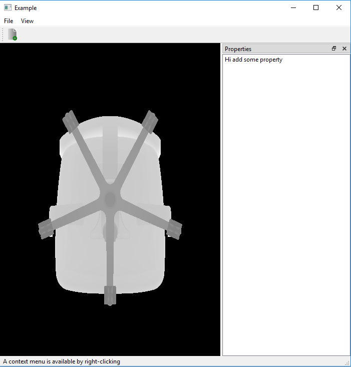

# 06_stl_reader
3D model reading from stl file both binary and ascii

Load a stl file of 3D model:
  1)STLreader class read both ascii and binary format of 3D model
  2)TestCube class is the model use cube_a.stl(ascii) or cube_b.stl(binary)
  3)Chair.stl is used in current rendering (scale down model to Normalized Device Coordinates)
  4)Coloring is done with fragments depth Color (glFragCoord.z)
  
Output Image:

